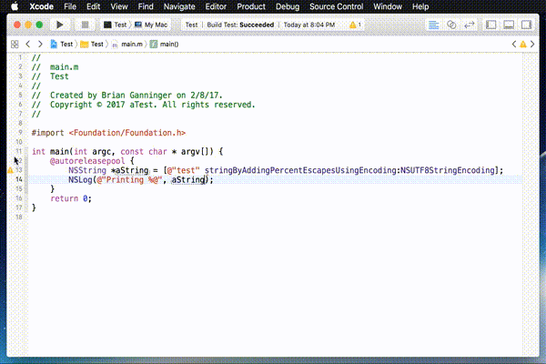
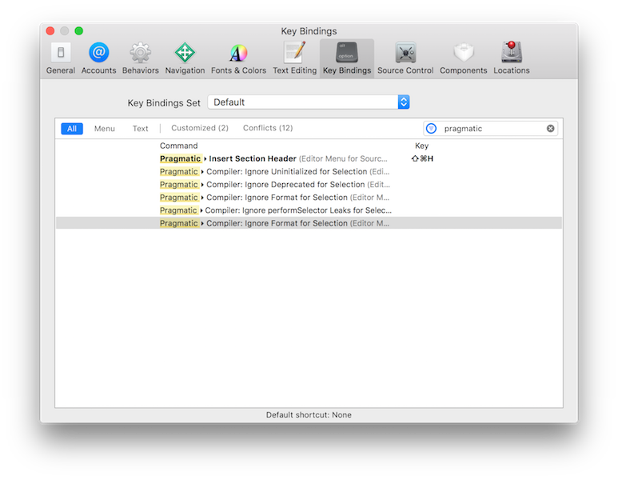

# Pragmatic

`Pragmatic` is an Xcode 8.*x* Source Editor extension for simplifying common pragma driven tasks.

## Features

- ✅ Insert Section Header
- ✅ Insert Custom Warning
- ✅ Insert Pragma Once Guard
- ✅ Ignore Uninitialized for Selection
- ✅ Ignore Deprecated for Selection
- ✅ Ignore performSelector Leaks for Selection
- ✅ Ignore Format for Selection
- 📎 Preferences panel

## Supported languages

- Objective-C
- C++ *(untested)*
- C

## Supported OSes

- OS X 10.11 *(El Capitan)*
- macOS 10.12 *(Sierra)*

## Tips

Set up key bindings in Xcode to speed up usage! 

## Contributing
  
This project is a team effort from concept to community and there are many ways to contribute. Please join in today! *(just make sure to follow the [Code of Conduct](CODE_OF_CONDUCT.md))* 😀

  * [Star and Watch This Repository](https://github.com/bgannin/Pragmatic/)
  * [File Or Comment On Issues](https://github.com/bgannin/Pragmatic/issues)
  * [Write Documentation](https://github.com/bgannin/Pragmatic/wiki)
  * [Submit Pull Requests](https://github.com/bgannin/Pragmatic/pulls) *(check Issues first!)*

## Contributors

## License

`Pragmatic` is released under the MIT license. Please see the [LICENSE](LICENSE.md) file for additional details.
